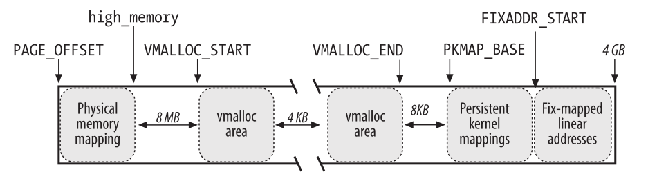
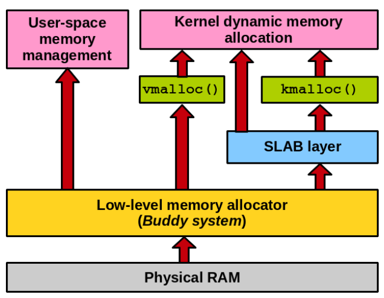

> 本文部分内容由 GPT-4 生成，并进行了人工校对。

## 我的程序在什么上下文运行？

> Ref: 
> - https://www.cnblogs.com/sky-heaven/p/15953338.html
> - https://wenboshen.org/posts/2015-12-18-kernel-stack
> - [Linux内核源代码情景分析](https://raw.githubusercontent.com/lancetw/ebook-1/master/03_operating_system/Linux%E5%86%85%E6%A0%B8%E6%BA%90%E4%BB%A3%E7%A0%81%E6%83%85%E6%99%AF%E5%88%86%E6%9E%90.pdf)
> - (TODO) ULK

粗略的说，为了分时地跑 “正常” 的 C 代码，我们需要：
- 稳定的寄存器值：代码本身被调度出去再恢复后，应该有相同的寄存器上下文
- 一个还算大的、专门的栈空间

粗略来说，内核有四种上下文：
- 进程的用户态上下文：某个 CPU 正常执行用户态程序时，就在这个上下文
  - 栈：某个进程虚拟地址空间的区域，描述信息在 `task_struct->mm->vm_area`
    > Related: ulimit 指定栈大小的机制是利用 heap 区域的缺页中断，然后向 mm 子系统要新页，直到到达设定的上限实现的
- 进程的用户态信号处理程序上下文：在内核态返回用户态时，有 pending 的 signal 从而需要执行信号处理程序的场合
  > Ref: http://courses.cms.caltech.edu/cs124/lectures-wi2016/CS124Lec15.pdf
  > - Note: this is for 2.6 kernel
  - 栈：使用用户态上下文的栈，栈顶额外保存如下信息
    - register state of interrupted process
    - other signal handler details
    - signal handler 的参数
    - sigreturn 的地址
      - 来保证函数执行后返回时 return 到一个 trampoline 上，syscall NR_sysreturn 进内核，然后恢复现场
- 进程的内核态上下文：某个 CPU 上的用户进程 syscall 进内核后使用的 stack
  - 栈：`task_struct->stack`，a.k.a. *内核栈*
    - 如果是从用户态进入内核态，或者该 task 在用户态，则内核栈是空的
    - 进程的内核态执行也可以被抢占 (Kernel 2.6+, Kernel Preempting) / 主动 yield
      > Ref: [Driver porting: the preemptible kernel - LWN.net](https://lwn.net/Articles/22912/) 
      - 内核代码可以主动关闭 / 恢复抢占，来保证临界代码的有序
        > 懒人做法 `spin_lock_irqsave`
  > TODO: Context saving
- 中断上下文
  - TODO: stack and context saving


## 我应该如何调试内核？

## 并发控制

### spinlock

### rcu

### 断言

- `might_sleep()`：断言当前上下文允许 sleep
  - 通常意义上，不能在比如拿着自旋锁的时候 sleep
  > Ref: [Why can't you sleep while holding spinlock? - Stack Overflow](https://stackoverflow.com/questions/4752031/why-cant-you-sleep-while-holding-spinlock)
- `lockdep`: Runtime locking correctness validator
  - lockdep_assert_none_held_once()

## 内存管理

### 进程地址空间

Ref:
- https://github.com/lorenzo-stoakes/linux-vm-notes/blob/master/sections/process.md
- https://linux-kernel-labs.github.io/refs/heads/master/lectures/address-space.html
- http://www.wowotech.net/process_management/context-switch-tlb.html
- Linux中的kmap https://www.zhihu.com/tardis/zm/art/69329911
- Linux中的内核地址空间 (x86) https://zhuanlan.zhihu.com/p/68501351
- Memory Management for ARM32 https://wenboshen.org/posts/2015-02-02-arm32-mm
- https://d3s.mff.cuni.cz/files/teaching/nswi161/2022_23/05_linux_memory.pdf
- https://linux.laoqinren.net/linux/proc-memory/

Linux 在设计地址空间时使用了 shared address space scheme，这样进入 syscall 的时候就不需要刷新 TLB 了，而只需要在切换用户进程的时候刷新。
> 还有很多优化来处理 TLB 的刷新，比如内核线程的 task->mm 是空的 (没有用户地址空间)，这样从用户进程切换到内核线程的时候不需要刷新 TLB，像引用 mm 的话用 `..->active_mm`
> 
> 比如有些体系结构可以在 TLB 中标记页表的地址翻译情况 (ARM ASID, x86 PCID) 等等

这样虚拟地址就分三种：
1. Linear mapping 区域 (lowmem)
   - 和物理地址永远差一个常数的固定偏移的虚拟地址空间区域
   - 故而，换算 phys <-> virt 地址不需要 (手动) page table walk，访问所需要的 TLB entry 也很少
   - 存储内核常用的数据结构
2. Highmem 区域
  - 因为历史上 x86 kernel space 的一开头是 linear mapping 的 low mem (以物理地址计)，所以这块在 phys 地址上属于 “highmem”，故为 highmem 区域
  - 可以任意映射的虚拟地址空间
    - x86 上访问 lowmem 外的物理地址严格需要先用 highmem 区域建立目标区域的映射才可以
    - x86_64 的 lowmem 区域其实已经映射了全部物理地址了，所以这个区域主要用来建立任意映射
  - Highmem 区域有多种类型的映射
    1. 多页永久映射 “Multi-page permanent mappings” (`vmalloc`, `ioremap`)
       - `vmalloc`: allocate non-contiguous system memory pages as a contiguous segment in the kernel virtual address space
       - `ioremap`: map device memory or device registers into the kernel address space. Maps a contiguous physical memory range into highmem with page caching disabled.
    2. Temporary 1 page mappings (`kmap_atomic`)
       - **在 x86_64 架构不存在** (因为其实没有用，可以直接用 lowmem 区域寻址所有内存，不需要表演杂技)
       - 用的是 fixed-mapped linear addresses 中的虚拟地址，用 `kmap_atomic()` 和 `kunmap_atomic()` 映射到一个用户指定的页上面去，中间不允许抢占
       - 相当于直接把这边的页表一改，然后 flush pte，然后就用，用完了你 kunmap 时候把页表摘下来之类的
    3. Permanent 1 page mappings (kmap, fix-mapped linear addresses)
       - **在 x86_64 架构不存在** (因为其实没有用，可以直接用 lowmem 区域寻址所有内存，不需要表演杂技)
       - 有比较少的固定页面 (e.g. 1024 pages) 可以供映射到这个区域
       - 用 kmap 和 kunmap 来使用这块区域，调用时会首先查询区域占用


下面展示了大概的**虚拟**地址空间划分。

注意，开启 KASLR ([RANDOMIZE_BASE](https://elixir.bootlin.com/linux/v6.8.5/source/arch/x86/Kconfig#L2156) 和 [RANDOMIZE_MEMORY](https://elixir.bootlin.com/linux/v6.8.5/source/arch/x86/Kconfig#L2229) 等) 后 offset 会有微小浮动以避免 ROP 等。每个架构细节不同。 

#### x86



> 图片来源于 Understanding the Linux Kernel。

```
TASK_SIZE = 0xC0000000
PAGE_OFFSET = 0xC0000000
```

```
00000000 - c0000000 (3GB)   user space, different per mm
c0000000 - f7ffffff (896MB) direct mapping for some of the phys memory (0~896MiB)
f8000000 - ffffffff (128MB) highmem space
  1. vmalloc, ioremap space
  2. PKMAP (persistent kernel mapping space)
  3. FIXADDR (fixed linear mapping space)
```

#### x86_64

```
0000000000000000 - 00007fffffffffff (=47 bits) user space, different per mm
hole caused by [48:63] sign extension
ffff800000000000 - ffff87ffffffffff (=43 bits) guard hole, reserved for hypervisor
ffff880000000000 - ffffc7ffffffffff (=64 TB) direct mapping of all phys. memory
ffffc80000000000 - ffffc8ffffffffff (=40 bits) hole
ffffc90000000000 - ffffe8ffffffffff (=45 bits) vmalloc/ioremap space
ffffe90000000000 - ffffe9ffffffffff (=40 bits) hole
ffffea0000000000 - ffffeaffffffffff (=40 bits) virtual memory map (1TB)
... unused hole ...
ffffec0000000000 - fffffc0000000000 (=44 bits) kasan shadow memory (16TB)
... unused hole ...
ffffff0000000000 - ffffff7fffffffff (=39 bits) %esp fixup stacks
... unused hole ...
ffffffef00000000 - ffffffff00000000 (=64 GB) EFI region mapping space
... unused hole ...
ffffffff80000000 - ffffffffa0000000 (=512 MB)  kernel text mapping, from phys 0
ffffffffa0000000 - ffffffffff5fffff (=1526 MB) module mapping space
ffffffffff600000 - ffffffffffdfffff (=8 MB) vsyscalls
ffffffffffe00000 - ffffffffffffffff (=2 MB) unused hole
```

### buddy 系统 (页分配器)

> 1. https://d3s.mff.cuni.cz/files/teaching/nswi161/2022_23/05_linux_memory.pdf
> 2. Q: buddy 系统的内存是从哪里分配的？ Claude-3-Opus

Buddy 系统管理的是系统的物理内存页面，这些页面在系统启动时就已经存在。Buddy 系统的内存并不是从其他地方"分配"的，而是对已有的物理内存进行管理和分配。

系统启动时，内存管理子系统会对可用的物理内存进行探测和初始化。探测到的物理内存范围会被划分为多个内存节点（node），每个节点对应一个 pg_data_t 结构，即 struct pglist_data。

接着，每个内存节点的可用物理内存会被划分为多个内存域（zone），如 ZONE_DMA、ZONE_NORMAL、ZONE_HIGHMEM 等，以适应不同的内存地址范围和用途。

初始化完成后，每个内存域的空闲页面都会被加入到 buddy 系统中进行管理。Buddy 系统为每个内存域维护了多个空闲页面链表，每个链表中的页面块大小都是 2 的幂次方，如 1、2、4、8、16 等。

当内核需要分配内存时，buddy 系统就从这些空闲页面链表中查找和分配适当大小的页面块。当内存释放时，buddy 系统会将页面归还到对应的空闲链表中，必要时还会将相邻的空闲页面合并以减少外部碎片。

因此，buddy 系统管理的内存来源于系统启动时探测到的物理内存，经过一系列的初始化和组织，形成了内存节点和内存域，并以 2 的幂次方大小的页面块组织在空闲链表中，供内核分配和使用。

`struct page *alloc_pages(gfp_t gfp_mask, unsigned int order)` 来分配 2^order 个连续物理页面
- `alloc_pages_node(int nid, ...)` to indicate the preferred numa node

`gfp_mask` - bitmask for the allocation mode

- Restrict to/allow specific zones - `__GFP_DMA`, `__GFP_DMA32`, `__GFP_HIGHMEM`, `__GFP_MOVABLE`
- Define allocation context wrt possibility of doing memory reclaim if free memory not available anymore
  - `__GFP_KSWAPD_RECLAIM`, `__GFP_DIRECT_RECLAIM`, `__GFP_IO`, `__GFP_FS`
- Define allocation context wrt how hard to try succeed vs availability to fallback
  - Reserves access: `__GFP_HIGH`, `__GFP_MEMALLOC`, `__GFP_NOMEMALLOC`
  - Urgency: `__GFP_NORETRY`, `__GFP_RETRY_MAYFAIL`, `__GFP_NOFAIL`
- Page mobility hints to help anti-fragmentation mechanisms
  - `__GFP_MOVABLE`, `__GFP_RECLAIMABLE`
- Standard combinations defined for most typical contexts:
  - `GFP_KERNEL`: `__GFP_RECLAIM` | `__GFP_IO` | `__GFP_FS` - unmovable allocation, can reclaim both by kswapd and directly
  - `GFP_HIGHUSER_MOVABLE`: `GFP_KERNEL` | `__GFP_HIGHMEM` | `__GFP_MOVABLE` - can reclaim, can use highmem and movable zones, pages are going to be movable
  - `GFP_NOWAIT`: `__GFP_KSWAPD_RECLAIM` - unmovable kernel allocation, cannot direct reclaim
  - `GFP_ATOMIC`: `__GFP_KSWAPD_RECLAIM` | `__GFP_HIGH` - like `GFP_NOWAIT` but higher priority, can dip into reserves

值得注意的是，调用 sbrk / brk / mmap 系统调用时分配的、用于用户态程序的页面也是由 buddy 系统管理的。

`proc` 中可以查看 buddy 系统中的页面的详细情况：

- `buddyinfo`：该文件的内核实现比较简单，直接输出每个 zone 对应的 `free_area[order].nr_free`
- `pagetypeinfo`：各个 zone 中的不同迁移类型的详细状态信息
  - 跟 `buddyinfo` 不同，这里直接输出的 page 的个数，而不是 order 对应的伙伴系统的空闲块的个数

下面这两种也会输出 slab、watermark、页面类型统计等信息：
- `zoneinfo`：系统上 zone 的信息
- `vmstat`：虚拟内存统计信息

其它由 buddy 实现的分配功能：
- `vmalloc(size)` 和 `kvmalloc(size, gfp_mask)`
- `__get_free_pages(gfp_mask, order)`

### 小对象分配器 slab (SLAB / SLUB / SLOB)

> Ref: 
> - (⭐) https://hammertux.github.io/slab-allocator
> - https://www.kernel.org/doc/gorman/html/understand/understand011.html
> - 2.10 内核缓冲区的管理
> - https://www.kernel.org/doc/html/next/core-api/memory-allocation.html



小对象分配器，通用名一般以 slab 代称。不过具体实现目前有三种（`SLOB`,`SLAB`,`SLUB`），可以在编译时切换。

实现类型：
- `SLOB` Allocator: Was the original slab allocator as implemented in Solaris OS. Now used for embedded systems where memory is scarce, performs well when allocating very small chunks of memory. Based on the first-fit allocation algorithm.
- `SLAB` Allocator: An improvement over the SLOB allocator, aims to be very “cache-friendly”.
- `SLUB` Allocator: Has better execution time than the SLAB allocator by reducing the number of queues/chains used.

可以用 `/proc/slabinfo` 查看当前的情况。

slab 主要提供两种类型的分配服务：
1. 专用对象池：caches that are created in the kernel for commonly used objects (e.g., `mm_struct`, `vm_area_struct`, etc…)
   - 一个对象池的显然好处就是加快这些相同大小内容的分配和释放
2. 通用对象池：有一系列大小 (size-N and size-N(DMA)) 的池子，in most cases are of sizes corresponding to powers of two.

slab 相关的分配函数：
- `kmem_cache_alloc(kmem_cache, gfp_mask)`：从指定的 slab 缓存中分配一个对象
- `kmalloc(size, gfp_mask)`
  - Variants: `kzalloc` 分配并清零；`krealloc` 重新分配


### 引用计数

## 设备发现

### Platform Device

- https://www.cnblogs.com/xiaojiang1025/p/6367061.html
- https://doc.embedfire.com/linux/imx6/base/zh/latest/linux_driver/platform_driver.html

## 常见数据结构

> Ref:
> - [Linux kernel design patterns - part 1 - LWN.net](https://lwn.net/Articles/336224/)
> - [Linux kernel design patterns - part 2 - LWN.net](https://lwn.net/Articles/336255/)
### 链表

在 `linux/list.h` 中实现。

> Ref:
> - [Use of double pointer in linux kernel Hash list implementation - Stack Overflow](https://stackoverflow.com/questions/3058592/use-of-double-pointer-in-linux-kernel-hash-list-implementation)
> - [lilijreey/linux-kernel-node - GitHub](https://github.com/lilijreey/linux-kernel-node/blob/master/hlist.c)

```c
// 普通的双向链表；用 container_of 宏来嵌入到一般的数据结构中
struct list_head {
	struct list_head *next, *prev;
};
```

```c
/*
 * Double linked lists with a single pointer list head.
 * Mostly useful for hash tables where the two pointer list head is
 * too wasteful.
 * You lose the ability to access the tail in O(1).
 */
struct hlist_head {
	struct hlist_node *first;
};

// 最后一个node的 next 为NULL
// pprev是一个二级指针， 它指向前一个节点的next指针的地址
// 这样做是为了把第一个hlist_head 和 hlist_node 的操作统一。
// 不管一个hlist_node 的 上一个是hlist_head 还是 hlist_node, 
// 同可以通本身来改变上一个节点的next值，（*prev=self->next)
struct hlist_node {
	struct hlist_node *next, **pprev;
};
```

### 哈希表

在 `linux/hashtable.h` 中实现。

关键数据结构如下

```c
// 本质上就是一个 hlist_head 数组，里面有 2^bits 个 bucket，当 hash 冲突的时候，重复元素会被放到该槽位在的链表中去 
#define DECLARE_HASHTABLE(name, bits) 	\
	struct hlist_head name[1 << (bits)]
```

> Ref: [A generic hash table - LWN.net](https://lwn.net/Articles/510202/)

1. `DECLARE_HASHTABLE(name, bits)`: 声明并定义一个名为`name`、大小为 `2^bits` 的哈希表
   - `struct hlist_head name[1 << (bits)]`
   > `DEFINE_HASHTABLE` 会同时做下清零
2. `hash_init(table)`: 初始化名为`table`的哈希表，将所有桶(heads)的值设为NULL，表明哈希表为空。
3. `hash_add(table, node, key)`: 添加一个元素到哈希表。`table`是你的哈希表，`node`是你的哈希表节点，而`key`则是哈希键值。
   - `node`: the &struct hlist_node of the object to be added
4. `hash_del(node)`: 删除哈希表中的一个元素。
5. `hash_empty(table)`: 检查哈希表是否为空。
6. `hash_for_each_possible(table, obj, member, key)`: 遍历所有可能哈希到同一个键(`key`)的元素。如果你的哈希函数可能返回多个桶(bucket)，那么这个函数会在所有可能的桶中搜索。
   - `member`: the name of the hlist_node within the struct
7. `hash_for_each_safe(table, bkt, tmp, obj, member)`: 安全地遍历哈希表中的元素。这是一个安全的宏，即使在遍历过程中删除元素，也不会出错。`bkt`保存的是哈希桶的索引，`tmp`用于临时存储链表项的信息，确保遍历的安全，`obj` 是元素的类型的一个指针，`member` 是哈希表节点在元素类型中的名字。
8. `hash_for_each(table, bkt, obj, member)`: 遍历哈希表中的元素，`bkt`用于存储当前桶的索引，`obj`是用户类型的一个指针，`member`是哈希表节点在用户类型中的名字。

此哈希表使用开放寻址法实现，因此在某个位置发生哈希冲突时，它会将新的元素存放到一个链表中。


