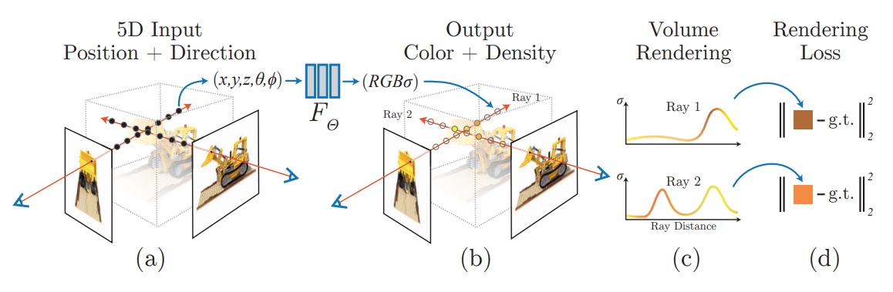
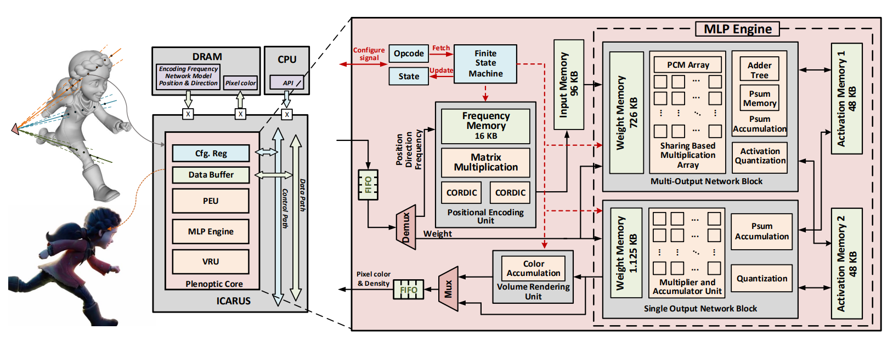

## 简介

本篇文章介绍了 NeRF 硬件加速的实现。

## NeRF 回顾

Neural Radiance Field，简称 NeRF，最开始在 ECCV 2020 上[被提出](https://www.matthewtancik.com/nerf)，提出了以神经网络编码辐射场的一种技术，并且将其运用到了基于图片的场景重建等多个领域中，是近年来受关注度相当高的一篇工作。

NeRF 的网络部分输入为 5D: 位置 $ (x,y,z) $ 和朝向 $ (\theta, \phi) $，输出为该位置的 RGB 颜色和密度。

NeRF 在给定相机位置下最终渲染的输出用类似体渲染 (Volumetric Rendering) 的办法来实现。

### NeRF 体渲染

对给定的相机光线 $ {\bf r}(t) = {\bf o} + t{\bf d} $ 来说，最终输出的颜色 $ {\bf C}(r) $ 以下式表示：

$$
C({\bf r}) = \int_{t_n}^{t_f} T(t) \sigma({\bf r}(t)) {\bf c}({\bf r}(t), {\bf d}) dt 
$$

其中：
- $ T(t) = \exp (-\int_{t_n}^{t} \sigma({\bf r}(s)) ds ) $ 为光线从 $ t_n $ 能打到 $ t $ 的概率
  - 比如说，如果射线穿过的部分密度都比较大，那 $ T(t) $ 就会比较小
- $ \sigma({\bf r}(t)) $ 是该 $ t $ 对应的点 $ {\bf r}(t) $ 的密度
- $ {\bf c}({\bf r}(t), {\bf d}) $ 是网络给定方向和位置后输出的 RGB 颜色值
- $ t_n $ 和 $ t_f $ 分别为射线进入和射出 NeRF 有效区域的包围盒时所对应的最近和最远参数值

不过这个积分显然不能很容易的解析求解，NeRF 的做法是采用数值积分的那一套。

首先，利用分层抽样 (stratified sampling) 的技术，将 $ [t_n, t_f] $ 分成 $ N $ 个均匀的小区间，然后在每个小区间均匀采样出一个 $ t_i $ 出来。

然后，用下面的量 $ \hat C({\bf r}) $ 来估计上面的 $ C({\bf r}) $：

$$
\hat C({\bf r}) = \sum_{i=1}^{N} T_i (1-\exp(-\sigma_i \delta_i)) {\bf c}_i
$$

其中：
- $ T_i = \exp(- \sum_{j=1}^{i-1} \sigma_j \delta_j) $
- $ \delta_i = t_{i+1} - t_i $ 为两临近采样点的距离

> 为什么会变成这个形式？可以参考 arXiv 上的 [Volume Rendering Digest (for NeRF)](https://arxiv.org/pdf/2209.02417.pdf)

<!-- 没看，TODO: 研究一下 -->

原文中提到，从所有的 $ ({\bf c}_i, \delta_i) $ 对考虑的话，$ \hat C(r) $ 的计算显然是可微的，并且可以看成从最开始一直用 $ \alpha_i = 1 - \exp(\sigma_i \delta_i) $ 的透明度往上面做 alpha blending。

<!-- TODO: why alpha value like that -->

### NeRF 网络

网络部分用位置编码 (Positional Encoding) + Coarse MLP + Fine MLP。

#### 位置编码 

位置编码用来改善网络对高频细节的学习效果。

位置编码层可以如下描述：

$$
\gamma(p) = (\sin(2^0 \pi p), \cos(2^0 \pi p), ..., \sin(2^{L-1} \pi p), \cos(2^{L-1} \pi p))
$$

#### Coarse & Fine MLP

NeRF 同时使用两个 MLP 来表示场景，一个粗粒度 MLP 和一个细粒度 MLP。

渲染的时候，首先用分层抽样的办法，在粗粒度网络中用前面提到的体渲染方法进行渲染，并且得到输出 $ \hat C_c(r) $：

$$
\hat C_c(r) = \sum_{i=1}^{N_c} w_i c_i, \quad w_i = T_i (1-\exp(\sigma_i \delta_i))
$$

然后，计算归一化权重 $ \hat w_i = w_i / \sum_{i=1}^{N_c} w_i $，并且用计算好的归一化权重作为概率分布函数 (cumulative distribution function)，再在这条直线上采样 $ N_f $ 个位置，将这 $ N_c + N_f $ 个位置送入细粒度 MLP 进行推理，再用前面的办法渲染得到最终的颜色值。

#### 损失函数

采用简单的把 Coarse MLP 和 Fine MLP 与真实值之间的 $ L^2 $ 损失直接加起来的办法。

## ICARUS

### Positional Encoding Unit

CORDIC: https://zipcpu.com/dsp/2017/08/30/cordic.html

### MLP Engine

### Volume Rendering Unit

### 性能评价

