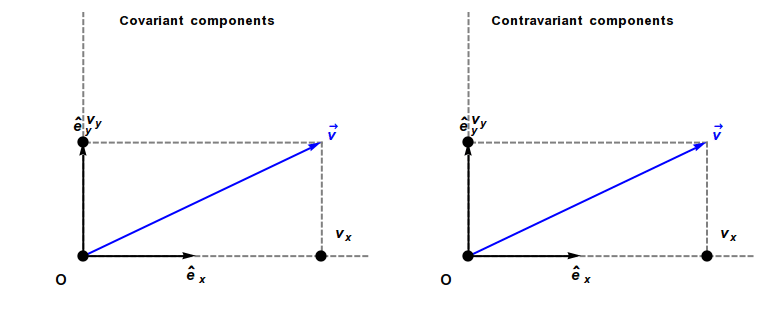

# 张量和矢量

> Ref:
>
> 1. [张量分析初步和矢量恒等式 - CSDN](https://blog.csdn.net/qq_23997101/article/details/78181074)
> 2. [电动力学 em02 - 杨焕雄](http://staff.ustc.edu.cn/~hyang/em/em02.pdf)
> 3. 张量分析笔记 - 知乎专栏
>    1. https://zhuanlan.zhihu.com/p/56850779
>    2. https://zhuanlan.zhihu.com/p/57431006
>    3. https://zhuanlan.zhihu.com/p/60130562
>    4. https://zhuanlan.zhihu.com/p/61252553
>    5. https://zhuanlan.zhihu.com/p/61908838
>    6. https://zhuanlan.zhihu.com/p/63515274
>    7. https://zhuanlan.zhihu.com/p/64157788
>    8. https://zhuanlan.zhihu.com/p/65002019
> 4. [对偶空间 - 维基百科](https://zh.wikipedia.org/wiki/%E5%AF%B9%E5%81%B6%E7%A9%BA%E9%97%B4)
> 5. [Covariance and contravariance of vectors - Wikipedia](https://en.wikipedia.org/wiki/Covariance_and_contravariance_of_vectors)
> 6. [怎么形象地理解对偶空间（Dual Vector Space）？ - 青春的回答 - 知乎](https://www.zhihu.com/question/38464481/answer/1136002204)

> TODO: **统一一下下面的符号规范**

## 张量

$ m $ 维 $ n $ 阶张量：一个有 $ n $ 个自由下标，每个下标可以取从 1 到 m 的整数的多维数组

> 用张量是否隐含着标准正交基？
>
> 看 [这里](http://staff.ustc.edu.cn/~xtao/courses/ce/downloads/ddlx_1.pdf) 的时候里面的张量都是定义在 $ e_i, e_j, e_k $ 上面的 “高阶矢量”
>
> （高阶：$ e_i $ 一阶，$ e_i e_j $ 二阶，$ e_i e_j e_k $ 三阶..） 

### 基本记号

- (Kronecker) $ \delta_{ij} $，仅当 $ i = j $ 时取值为 1，否则为 0
- (置换符号) $ \epsilon_{ijk} $ 的下标偶排列为 1，奇排列 -1，重复为 0

### 常用关系

$$
\delta_{ij} \delta_{mj} = \delta_{im} \\

\epsilon_{i j k}= \sum_{i, j, k} \epsilon_{ijk} \delta_{i1} \delta_{j2} 
$$

$$
\epsilon_{ijk} \epsilon_{mnk} = \epsilon_{kij} \epsilon_{kmn} = \delta_{im} \delta_{jn} - \delta_{in} \delta_{jm}
$$

> 证明：
>
> 根据行列式的定义有
> $$
> \left|\begin{array}{lll}
> a_{11} & a_{12} & a_{13} \\
> a_{21} & a_{22} & a_{23} \\
> a_{31} & a_{32} & a_{33}
> \end{array}\right|=e_{i j k} a_{i 1} a_{j 2} a_{k 3}=e_{i j k} a_{1 i} a_{2 j} a_{3 k}
> $$
> 列换序有
> $$
> \left|\begin{array}{lll}
> a_{1 r} & a_{1 s} & a_{1 t} \\
> a_{2 r} & a_{2 s} & a_{2 t} \\
> a_{3 r} & a_{3 s} & a_{3 t}
> \end{array}\right|=e_{r s t} e_{i j k} a_{i 1} a_{j 2} a_{k 3}
> $$
> 行换序有
> $$
> \left|\begin{array}{lll}
> a_{o r} & a_{o s} & a_{o t} \\
> a_{p r} & a_{p s} & a_{p t} \\
> a_{q r} & a_{q s} & a_{q t}
> \end{array}\right|=e_{o p q} e_{r s t} e_{i j k} a_{i 1} a_{j 2} a_{k 3}
> $$
> 所以
> $$
> \left|\begin{array}{lll}
> \delta_{o r} & \delta_{o s} & \delta_{o t} \\
> \delta_{p r} & \delta_{p s} & \delta_{p t} \\
> \delta_{q r} & \delta_{q s} & \delta_{q t}
> \end{array}\right|=e_{o p q} e_{r s t} e_{i j k} \delta_{i 1} \delta_{j 2} \delta_{k 3}=e_{o p q} e_{r s t} e_{123}=e_{o p q} e_{r s t}
> $$
> 取 $ o = r $ 得到
> $$
> \begin{eqnarray}
> 
> e_{rpq}e_{rst} &=&
> \left|
> \begin{array}{lll}
> 3 & \delta_{rs} & \delta_{rt} \\
> \delta_{pr} & \delta_{ps} & \delta_{pt} \\
> \delta_{qr} & \delta_{qs} & \delta_{qt}
> \end{array}
> \right|
> \\ &=& 3(\delta_{ps} \delta_{qt} - \delta_{qs} \delta_{pt}) - (
> \delta_{rs}
> \left|
> \begin{array}{ll}
> \delta_{pr} & \delta_{pt} \\
> \delta_{qr} & \delta_{qt} \\
> \end{array}
> \right|
> 
> ) + (
> \delta_{rt}
> \left|
> \begin{array}{ll}
> \delta_{pr} & \delta_{ps} \\
> \delta_{qr} & \delta_{qs} \\
> \end{array}
> \right|
> ) \\
> 
> &=& 3(\delta_{ps} \delta_{qt} - \delta_{pt} \delta_{qs}) - (\delta_{pr} \delta_{rs} \delta_{qt} - \delta_{qr} \delta_{rs} \delta_{pt}) + (\delta_{pr} \delta_{rt} \delta_{qs} - \delta_{qr} \delta_{rt} \delta_{ps}) \\
> &=& 3(\delta_{ps} \delta_{qt} - \delta_{pt} \delta_{qs}) - (\delta_{ps} \delta_{qt} - \delta_{qs} \delta_{pt}) + (\delta_{pt} \delta_{qs} - \delta_{qt} \delta_{ps}) \\
> &=& \delta_{qt} \delta_{ps} - \delta_{pt} \delta_{qs} \\
> \end{eqnarray}
> $$

$$
\epsilon_{ijk} \epsilon_{ijk} = 6
$$

> 证明：上面取 $ p = s, q = t $ 得到
>
> $$
> \begin{eqnarray}
> e_{rst}e_{rst} &=& \delta_{tt} \delta_{ss} - \delta_{st} \delta_{ts} \\
> &=& \delta_{tt} \delta_{ss} - \delta_{ss} \\
> &=& (\delta_{tt} - 1) \delta_{ss} \\
> &=& 2 \times 3 = 6
> \end{eqnarray}
> $$

$$
\epsilon_{ijk} \epsilon_{mjk} = 2\delta_{im}
$$

> 证明略

### 协变和逆变

#### 逆变

设有定义在标量 S 上的 n 维向量空间，并且有基 $ {\bf f} = (X_1, ..., X_n) $ 和 $ {\bf f'} = (Y_1, ..., Y_n) $，则基矢量的变换用
$$
\mathbf{f} \mapsto \mathbf{f}^{\prime}=\left(\sum_{i} a_{1}^{i} X_{i}, \ldots, \sum_{i} a_{n}^{i} X_{i}\right)=\mathbf{f} A
$$
表示，即
$$
Y_{j}=\sum_{i} a_{j}^{i} X_{i}
$$
如果向量空间中的向量 $ v$ 可以这样表示
$$
v=\sum_{i} v^{i}[\mathbf{f}] X_{i}
$$
记
$$
\mathbf{v}[\mathbf{f}]=\left[
\begin{array}{c}
v^{1}[\mathbf{f}] \\
v^{2}[\mathbf{f}] \\
\vdots \\
v^{n}[\mathbf{f}]
\end{array}
\right]
$$
则 $ \bf v $ 也可以写作矩阵形式
$$
{\bf v} = {\bf f v[f]}
$$
那么，他在 $ \bf f' $ 基下的表示应为
$$
\bf v = f' v[f']
$$
鉴于 $ \bf v $ 与基矢量选择无关，
$$
\bf f v[f] = f'v[f']=fAv[fA] \quad \leadsto \quad v[fA] = A^{-1}v[f]
$$
写成分量形式
$$
v^i[{\bf f} A] = \sum_i \tilde a_j^i v^j[{\bf f}] \qquad \tilde a表示A的逆
$$
此为**逆变**，因换基时是乘以逆矩阵。

#### 协变

定义在 V 上的线性函数，有
$$
\alpha(X) = \alpha(\sum_j a^j X_j) = \sum_j a^j \alpha (X_j) = \sum_j a^j \alpha_j[{\bf f}]
$$
其中定义 $ \alpha_j[{\bf f}] = \alpha (X_j) $。

则
$$
\begin{eqnarray}
\alpha[{\bf f'}] &=& \alpha[{\bf f}A] =  [\alpha_1[{\bf fA}], ..., \alpha_i[ {\bf fA}], ..., \alpha_n[{\bf fA}]] \\
&=& [..., \alpha_i(\sum_j a_i^j X_j), ...] \\
&=& [..., a_i^j \alpha_j[{\bf f}], ...] \\
&=& \alpha[{\bf f}] A
\end{eqnarray}
$$

> 为什么矩阵元素记作 $ a_i^j $？这反映了其中的协变和逆变关系：
>
> (TODO)

仔细观察，如果 $ \vec v $ 是一个线性变换的输出，那确实满足协变（E.g. 把 $ \vec e_x $ 变到 $ \vec v_x $）；而逆变就是矢量在不同基下的坐标满足的变换。

坐标系中的例子：TODO

**逆变的指标用上标，协变的指标用下标。**

### 协变和逆变 Revised

下面用张量的表示（包括协变和逆变），以及 Einstein 求和约定重构一下上面的章节。

> 感觉张量语言最大的好处就是区分了坐标和变换，而用普通的线性代数 & 矩阵那一套就会全混在一起，用之前要仔细区分...

首先，基变换的实质就是给定了新的基在旧的基下的**坐标**，根据上面的推导坐标是逆变的，所以
$$
\hat e_i = e_j R_i^j
$$
其中 $ \hat e_i $ 是新的基矢，$ R^j_i $ 可以看作 $ \hat e^i $ 在旧的基上的坐标，所以表示坐标的指标 $ j $ 在上面。

首先我们尝试推导矢量 $ \alpha $ 在旧的基的坐标 $ \alpha^i $ 和新的基下的坐标 $ \tilde \alpha^i $ 之间的关系：
$$
\begin{array}{cl}
\quad & \alpha = \alpha^i e_i = \tilde \alpha^i \hat e_i = \tilde \alpha^i e_j R^j_i \\
\Rightarrow & \alpha^j e_j = R^j_i \tilde \alpha^i e_j \\
\Rightarrow & \alpha^j = R^j_i \tilde \alpha^i\\
\Rightarrow & [\alpha^1, ...,\alpha^n]^\top = 
\begin{bmatrix}
R_1^1 & ... & R_n^1 \\
\vdots &    & \vdots \\
R_1^n & ... & R^n_n
\end{bmatrix}
[\tilde \alpha^1, ...,\tilde \alpha^n]^\top \\
\Rightarrow & \begin{bmatrix}
R_1^1 & ... & R_n^1 \\
\vdots &    & \vdots \\
R_1^n & ... & R^n_n
\end{bmatrix} ^ {-1}[\alpha^1, ...,\alpha^n]^\top = 

[\tilde \alpha^1, ...,\tilde \alpha^n]^\top \\

\Rightarrow & (R^{-1})_j^i \alpha^j = \tilde \alpha^i

\end{array}
$$

> 在求逆的时候算出来并不是 $ \alpha^j (R^{-1}) ^j_i = \tilde \alpha^i $，指标在左右同乘逆的时候互换了。
>
> **在列矢量表示方法下面，和向量乘的指标用在行内（就是列数的意思）**，记住这个应该可以快速反应（或者记坐标的上指标应该和矩阵的下指标乘..？）
>
> 写出逆矩阵：
> $$
> \begin{array}{cl}
>  & \alpha^j = R^j_i \tilde \alpha^i \\
>  \Rightarrow & R^{-1} \alpha^k = (R^{-1})^k_j R^j_i \tilde \alpha^i \\
>  \Rightarrow & (R^{-1})_m^k \alpha^m = (R^{-1})^k_j R^j_i \tilde \alpha^i \\
> \end{array}
> $$

可以看到这里有逆，所以是逆变的。

对于一个一般的线性变换 T，设 $ v $ 是某向量在基下的坐标，这样 $ (Tv) $ 就表示其基下变换后的向量。具体地说，$ (Tv)^i $ 是变换后向量的坐标，其满足 $ (Tv)^i = T_j^i v^j $。

考虑到基变换后线性变换的矩阵 $ \hat T = R^{-1} T R $（即 $\hat{T}_{j^{\prime}}^{i^{\prime}}=\left(R^{-1}\right)_{i}^{i^{\prime}} T_{j}^{i} R_{j^{\prime}}^{j}$），其中 $ R $ 为基变换矩阵，则
$$
(\widehat{T v})^{i^{\prime}}=\hat{T}_{j^{\prime}}^{i^{\prime}} \hat{v}^{j^{\prime}}=\left[\left(R^{-1}\right)_{i}^{i^{\prime}} T_{j}^{i} R_{j^{\prime}}^{j}\right]\left[\left(R^{-1}\right)_{j}^{j^{\prime}} v^{j}\right]=\left(R^{-1}\right)_{i}^{i^{\prime}}(T v)^{i}
$$
一般的，对于 $ p + q $ 阶，拥有 $ p $ 个逆变分量和 $ q $ 个协变分量的张量 $ T $ 来说有
$$
\hat{T}_{j_{1}^{\prime}, \ldots, j_{4}^{\prime}}^{i_{1}, \ldots, i_{p}^{\prime}}=\left(R^{-1}\right)_{i_{1}}^{i_{1}^{\prime}} \cdots\left(R^{-1}\right)_{i_{p}}^{i_{p}^{\prime}} T_{j_{1}, \ldots, j_{q}}^{i_{1}, \ldots, i_{p}} R_{j_{1}^{\prime}}^{j_{1}} \cdots R_{j_{q}^{\prime}}^{j_{q}}
$$
成立。

### 对偶空间

设 $V$ 为在域 $F$ 上的向量空间，定义其对偶空间 $V^*$ 为由 $V$ 到 $ F $ 的所有线性映射 $ V^* $  中的 $ \varphi $  及 $ \psi  $、所有 $ F $ 中的 $a$、所有 $V$中的 $x$ ，定义以下加法及标量乘法：
$$
(\phi + \psi )( x ) = \phi ( x ) + \psi ( x )  \\ 
 ( a \phi ) ( x ) = a \phi ( x )
$$

则在 $ V $ 是有限维线性空间的情形下，$ V^* $ 也是有限维线性空间。

$ V^* $ 存在一组线性无关组 $ \{ e^1, e^2, ..., e^n\} $ ，其中
$$
e^i(e_j) = \left\{
\begin{array}{cc}
1, & i = j  \\
0, &i \ne j
\end{array}
\right.
$$
容易验证这是 $ V^* $ 的一组基。$ V $ 到 $ F $ 的线性映射均可以在该基下用一组坐标表示。由于 $ \dim(V^*) = \dim(V) $，这组坐标可以认为是向量空间 $ V $ 中的元素。如上文，这组坐标在坐标系变换时是协变的。

例如，考虑 $ f \in V^*, v \in V $，则
$$
\begin{eqnarray}
f(\vec v) &=& \sum_i m_i e^i(\vec v) = \sum_i m_i e^i(\sum_j v^j \vec e_j) \\
&=& \sum_{i, j} m_i v^j e^i(\vec e_j) \\
&=& \sum_{i} m_i v^i
\end{eqnarray}
$$

### 度规

## 矢量分析

用张量的基本记号，矢量代数的基本计算公式可以归纳为
$$
\vec{e}_{i} \cdot \vec{e}_{j} = \delta_{ij}, \quad
\vec{e}_{i} \times \vec{e}_{j} = \epsilon_{ijk} \vec{e}_{k} \\
$$

> 注意，这里体现了 $e_1, e_2, e_3$ 是右手系，因为叉乘是定义为右手的 
>
> 另外注意 $ \epsilon $ 和逆序数的性质是一致的，即轮换不改变值 （$ ijk $，$ jki $，$ kij $ 相等）

所以
$$
\begin{eqnarray}
\vec A+ \vec B &=& (A_i + B_i) \vec{e}_{i} \\
\vec A \cdot \vec B &=& A_i B_i \\
\vec A \times \vec B &=& A_i B_j (\vec{e}_{i} \times \vec{e}_{j}) = \epsilon_{ijk} A_i B_j \vec{e}_{k} \\

\vec A \cdot (\vec B \times \vec C) &=& A_m \vec {e_m} \cdot (\epsilon_{jki} B_j C_k \vec{e}_{i}) = \epsilon_{ijk}A_mB_jC_k(\vec{e_m} \cdot \vec{e}_{i}) \\
&=& \epsilon_{ijk} A_mB_jC_k \delta_{mi} =\epsilon_{ijk} A_iB_jC_k
\\

\vec A \times (\vec B \times \vec C) &=& \vec{e}_{i} \epsilon_{ijk} A_j (\vec B \times \vec C)_k = \vec{e}_{i} \epsilon_{i j k} \epsilon_{m n k} A_{j} B_{m} C_{n} \\
&=& \vec{e}_{i}\left(\delta_{i m} \delta_{j n}-\delta_{i n} \delta_{j m}\right) A_{j} B_{m} C_{n} \\
&=& \vec{e}_{i}\left(B_{i} A_{j} C_{j}-C_{i} A_{j} B_{j}\right)=(\vec{A} \cdot \vec{C}) \vec{B}-(\vec{A} \cdot \vec{B}) \vec{C}

\end{eqnarray} \\
$$

> 有点像数理逻辑，要注意不要让名字冲突，这样求和的关系就错了
>
> 两个叉乘的时候，不妨先看出来最后的结果用的基矢的指标，然后再写分量（如上）

下面用简化表达式处理 **Cartesian 直角坐标系**中的算符：
$$
\nabla=\vec{e}_{1} \frac{\partial}{\partial x_{1}}+\vec{e}_{2} \frac{\partial}{\partial x_{2}}+\vec{e}_{3} \frac{\partial}{\partial x_{3}} \quad \leadsto \quad \nabla=\vec{e}_{i} \frac{\partial}{\partial x_{i}} \leadsto \nabla = \vec{e}_{i} \partial_i \\
\text{那么有} \quad \partial_{i} x_{j}=\delta_{i j}
$$

下面处理散度，注意偏导数算符是如何作用到乘法的：
$$
\nabla \cdot \vec{A}=\vec{e}_{i} \partial_{i} \cdot\left(A_{j} \vec{e}_{j}\right)=\left(\vec{e}_{i} \cdot \vec{e}_{j}\right) \partial_{i} A_{j}+A_{j} \vec{e}_{i} \cdot \partial_{i} \vec{e}_{j} \\
\text{因为直角坐标系的基矢是常矢量，所以} \quad \partial_{i} \vec{e}_{j}=0 \\
\nabla \cdot \vec{A}=\left(\vec{e}_{i} \cdot \vec{e}_{j}\right) \partial_{i} A_{j}=\delta_{i j} \partial_{i} A_{j} \quad \leadsto \quad \nabla \cdot \vec{A}=\partial_{i} A_{i}
$$
旋度如下：
$$
\nabla \times \vec{A}=\vec{e}_{i} \partial_{i} \times\left(A_{j} \vec{e}_{j}\right)=\left(\vec{e}_{i} \times \vec{e}_{j}\right) \partial_{i} A_{j}=\epsilon_{i j k} \vec{e}_{k} \partial_{i} A_{j}
$$
标量场的全微分 $ dF = d \vec{r} \cdot \nabla F $，所以在 Cartesian 直角坐标系里
$$
dF =d x_{i} \partial_{i} F= d \vec{r} \cdot \nabla F  =d x_{j} \vec{e}_{j} \cdot \nabla F=d x_{j}(\nabla F)_{j} \quad \leadsto \quad (\nabla F)_{i}=\partial_{i} F \\
\nabla F = \vec e_i \partial_i F
$$

> 下面都假设基矢有 $ \partial_{i} \vec{e}_{j}=0  $ 成立

### 恒等式证明练习

#### 梯度场无旋

$$
\begin{eqnarray}
\nabla \times \nabla F
&=& (\vec{e}_{i} \partial_{i}) \times (\vec e_j \partial_j F) \\
&=& \vec e_k \epsilon_{ijk} \partial_i \partial_j F \\

\end{eqnarray}
$$

这里可以观察到 $ \partial_i \partial_j F = \partial_j \partial_i F $，而 $ \epsilon_{ijk} $ 调换其中两个会变号，所以是 0。也可这样证：
$$
\begin{eqnarray}
\vec e_k \epsilon_{ijk} \partial_i \partial_j F &=&  \frac{1}{2} \vec e_k \epsilon_{ijk} \partial_i \partial_j F
 + \frac{1}{2} \vec e_k \epsilon_{ijk} \partial_i \partial_j F\\
 &=&  (\frac{1}{2} \vec e_k \epsilon_{ijk} \partial_i \partial_j F
 )+ (\frac{1}{2} \vec e_k \epsilon_{ijk} \partial_i \partial_j F)\\
 
\text{(换指标名)} \quad &=&  \frac{1}{2} \vec e_k \epsilon_{ijk} \partial_i \partial_j F
 + \frac{1}{2} \vec e_k \epsilon_{jik} \partial_j \partial_i F\\
\mathrm{(\because\partial_i \partial_j F = \partial_j \partial_i F)} \quad &=& \frac{1}{2} \vec e_k (\epsilon_{ijk} + \epsilon_{jik}) \partial_i \partial_j F = 0
\end{eqnarray}
$$

#### 旋度场无散

$$
\begin{eqnarray}
\nabla \cdot (\nabla \times \vec A) &=& (\vec e_m \partial_m) \cdot (\epsilon_{ijk} \partial_i A_j \vec e_k) \\
&=& \delta_{mk} \epsilon_{ijk} \partial_m \partial_i A_j \\
&=& \epsilon_{ijk} \partial_k \partial_i A_j \\
&=& \frac{1}{2} \epsilon_{ijk} \partial_k \partial_i A_j + \frac{1}{2} \epsilon_{kji} \partial_i \partial_k A_j \\
&=& \frac{1}{2} (\epsilon_{ijk} + \epsilon_{kji}) \partial_k \partial_i A_j \\
&=& 0
\end{eqnarray}
$$

> 脑子要清楚，想清楚现在的下标是对谁在求和...比如第一步里面如果写成了 $ m = i $ 就直接 GG 了...

#### 一些恒等式

下面的 $ \vec{f}=f_{i} \vec{e}_{i}, \quad \vec{g}=g_{i} \vec{e}_{i} $。
$$
\vec{f} \times \vec{g}=\vec{e}_{k} \epsilon_{k m n} f_{m} g_{n} \quad \leadsto \quad(\vec{f} \times \vec{g})_{k}=\epsilon_{m n k} f_{m} g_{n}
$$

$$
\begin{eqnarray}
\nabla \times(\vec{f} \times \vec{g})
&=& \vec e_j \epsilon_{ikj} \partial_i (\vec f \times \vec g)_k \\
&=& \vec e_j \epsilon_{ikj} \epsilon_{m n k} \partial_i (f_{m} g_{n}) \\
&=& \vec e_j (\delta_{jm} \delta_{in} - \delta_{jn} \delta_{im}) (f_m \partial_i g_n + g_n \partial_i f_m) \\
&=& \vec e_j (f_j \partial_i g_i + g_i \partial_i f_j) - \vec e_j(f_i \partial_i g_j + g_j \partial_i f_i) \\
&=&  (\vec{e}_{j} f_{j} ) (\partial_{i} g_{i} )+ (g_{i} \partial_{i} ) (\vec{e}_{j} f_{j} )- (f_{i} \partial_{i} ) (\vec{e}_{j} g_{j} )- (\vec{e}_{j} g_{j} ) (\partial_{i} f_{i} ) \\
&=& \vec{f}(\nabla \cdot \vec{g})+(\vec{g} \cdot \nabla) \vec{f}-(\vec{f} \cdot \nabla) \vec{g}-\vec{g}(\nabla \cdot \vec{f})
\end{eqnarray}
$$

> 这样也可以（全写开）：
> $$
> \begin{eqnarray}
> \nabla \times(\vec{f} \times \vec{g}) 
> &=& \vec e_j \epsilon_{ikj} \epsilon_{m n k} \partial_i (f_{m} g_{n}) \\
> &=& \vec e_j (\delta_{jm} \delta_{in} f_m \partial_i g_n + \dots - \delta_{jn} \delta_{im} f_m \partial_i g_n - \dots) \\
> &=&  \vec e_j (f_j \partial_i g_i + \dots -  f_i \partial_i g_j - \dots)
> \end{eqnarray}
> $$

$$
\begin{aligned}
\nabla \times(\nabla \times \vec{V}) &=\vec{e}_{m} \epsilon_{m n i} \partial_{n}(\nabla \times \vec{V})_{i} \\
&=\vec{e}_{m} \epsilon_{m n i} \partial_{n}\left[\epsilon_{i j k} \partial_{j} V_{k}\right] \\
&=\vec{e}_{m} \epsilon_{m n i} \epsilon_{j k i} \partial_{n} \partial_{j} V_{k} \\
&=\vec{e}_{m}\left[\delta_{m j} \delta_{n k}-\delta_{m k} \delta_{n j}\right] \partial_{n} \partial_{j} V_{k} \\
&=\vec{e}_{j} \partial_{j}\left(\partial_{k} V_{k}\right)-\vec{e}_{k} \partial_{j} \partial_{j} V_{k} \\
&=\nabla(\nabla \cdot \vec{V})-\nabla^{2} \vec{V}
\end{aligned}
$$

> Note: $ e_m $ “分成” 了 $ e_j $ 和 $ e_k $ 可能有点反直觉，但其实是因为求和的循环“少了一层”。
> $$
> \Delta =\nabla^2 = \sum_i \frac{\partial^2}{\partial x_i^2} = \partial_i \partial_i
> $$

