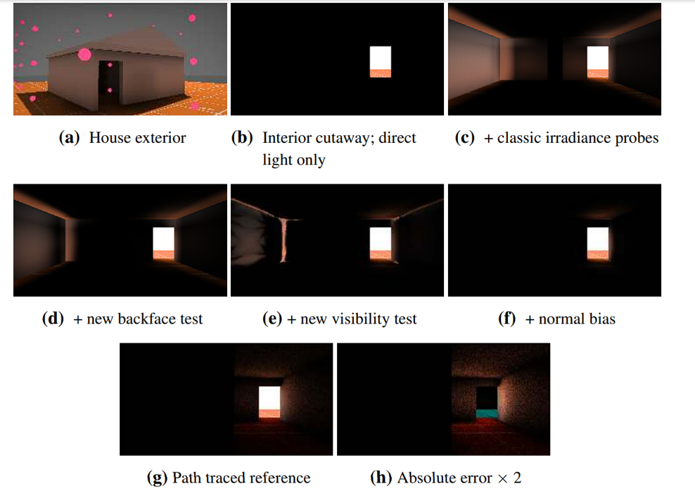

## 简介

本篇文章提供了一种高效的计算动态物体和动态光源情形下的全局光照的方法。

## 框架

### DDGI light probe

DDGI 是一种利用 light probe（光照探针）进行动态全局光计算的方法。

对于位于 $\mathrm{x'}$ 位置的 light probe，所有的出射方向可以视为从 probe 所在位置到以 probe 所在位置为中心的单位球面上点构成的向量的集合。此时，构造一个 $S^2 \to R^2$ 的映射，使得球面的八个扇区分别映射到八面体的八个面上，这个映射被称为八面体映射 (octahedron mapping)。

> 文章中描述到，八面体映射的好处，在于可以将球面以比较均匀的参数化映射到正方形上去，方便之后将每个方向相对应的量储存到 2D 纹理上面去。

通过八面体映射，就可以将 probe 每个方向的信息存储在正方形的纹理贴图上了。

不过，在这篇文章中，出于性能考虑，作者采用了类似 Variance Shadow Mapping 的方法，极大压缩了纹理贴图的分辨率，同时对于每个 probe 的贴图的每个方向，分别存放

1. $E_i(\mathrm{x'}, w)$: probe 以 $\omega$ 方向为天顶的半球的入射 irradiance
2. $r(\omega)$: probe 在 $\omega$ 方向对应的最近邻图元的距离在半球面的均值
   - 也就是 $\int d(x', \omega) d \omega$，其中 $d(x, \omega): R^3 \times \Omega \to R$ 为在 $x$ 处沿 $\omega$ 方向到最近邻图元的距离
3. $r^2(\omega)$: probe 在 $\omega$ 方向对应的最近邻图元的距离的平方在半球面的均值

三组信息。

> Recall: radiance 和 irradiance
> - Radiance (辐射率): 单位面积单位立体角辐射功率，$ d\Phi / (dS d\Omega) $
> - Irradiance (辐照度): 单位面积辐射功率 $ d\Phi / dS $

### 利用 probe 进行间接光计算

前面提到 probe 中存储的信息为 probe 所在位置中各个方向的入射 irradiance。如果把场景中各处的 irradiance 看成一个 irradiance 场，那么现在要处理的问题就是给定场在某些位置的值，插值出其他位置的值的过程。

对于漫反射，只需要关心入射 irradiance 而不需要具体的 radiance，所以只需要待着色图元的全局光入射 irradiance 信息。

irradiance 场大概可以这样描述：$R^3 \times S^2 \to Spectrum$

输入是 (位置, 方向)，输出是 Spectrum (e.g. RGBSpectrum)

可以想象到，如果场本身的变化相对于 probe 间距离来说变化比较缓慢，那么方法就会工作的比较好。

不过，也有一些会导致变化较快的情况：
1. 图元本身与 probe 所成夹角
2. 图元被某些物体遮挡

所以，DDGI 提出了这样的框架来进行着色：

```glsl
// float3 n = shading normal, X = shading point, P = probe location
float4 irradiance = float4(0);
for (each of 8 probes around X) {
    float3 dir = P – X;
    float r = length(dir);
    dir *= 1.0 / r;

    // smooth backface
    float weight = (dot(dir, n) + 1) * 0.5;

    // adjacency
    weight *= trilinear(P, X);

    // visibility (Chebyshev)
    float2 temp = texelFetch(depthTex, probeCoord).rg;
    float mean = temp.r, mean2 = temp.g;
    if (r > mean) {
        float variance = abs(square(mean) – mean2);
        weight *= variance / (variance + square(r – mean));
    }
    irradiance += sqrt(texelFetch(colorTex, probeCoord) * weight;
}
return square(irradiance.rgb * (1.0 / irradiance.a));
```

> `irradiance.a` 的作用是什么..？
>
> 很多权重我理解是为了视觉效果，应该和物理正确没什么太大关系...
> 
> 这里的也不是最终的版本（还要加上 normal bias），slides 里面提供了更加魔改的版本，不知道 RTXGI 里面是不是有更进一步的魔改

#### Chebyshev 项分析

Chebyshev 不等式 (one-tailed version)：

$$
P(x > t) \le \frac{\sigma^2}{\sigma^2 + (t-\mu)^2}
$$

> 可以参考 GAMES202 中[关于 Variance Soft Shadow Mapping 的部分](https://sites.cs.ucsb.edu/~lingqi/teaching/resources/GAMES202_Lecture_04.pdf)

相当于小于平均值时认为没有遮挡，大于平均值时按 Chebyshev 不等式的上界来估算被遮挡概率。

> 有没有更好的估计方法？为什么这样估计是最好的？

### 各个项效果对比

原论文中有各项的作用展示：



其中 classic irradiance probe 应该就是只有三线性插值的结果。

### 动态更新 probe 信息

每一帧，DDGI 会进行如下的操作：
1. 从 $m$ 个活跃 probe 中，每个 probe 发射 $n$ 条光线，然后存储 $n \times m$ 个交点处的表面元信息（位置，法线）到一个类似 G-buffer 的结构中
   - 发射光线时采用每帧不同的 pattern，最大限度避免锯齿
     - 作者采用 "stochastically-rotated Fibonacci spiral pattern"
       > 不过作者 2017 年的文章中并没有详细说明此处的具体实现，需要阅读作者的代码
2. 对表面元信息进行直接光和间接光计算
   - 直接光：
     - 点光源和方向光光源：利用该 G-buffer 进行普通的 deferred rendering + variance shadow mapping
     - 面积光光源：使用下面间接光方法，第一跳时考虑面积光
   - 间接光：采用周围的 probe 信息进行计算
     - 和前面一节描述的方法一致
   - (多跳)间接光：通过 3 中每次用 Moving Average 方法来更新，实现多跳的信息传播
3. 更新这 $m$ 个活跃 probe 对应的纹理贴图
   - 利用 alpha-blending, $\alpha$ 取 0.85 到 0.98
   - `newIrradiance[texelDir] = lerp(oldIrradiance[texelDir], Sum(ProbeRays(max(0,texelDir · rayDir) ∗ rayRadiance)...), alpha)`

> 符号说明: `lerp(a, b, alpha) = a * alpha + b * (1-alpha)`

### 对比

- [Real-Time Global Illumination using Precomputed Light Field Probes](https://research.nvidia.com/sites/default/files/pubs/2017-02_Real-Time-Global-Illumination/light-field-probes-final.pdf)
  - McGuire 这篇 2017 年的工作中关于 GI 的部分和这篇文章很像，只是当时他在 light probe 中存储比较高分辨率的最近邻图元到 probe 距离，并且用这个距离来进行基于 probe 阵列的 ray trace，而不是采用硬件 ray trace。
  - 并且他在这篇工作中提到，可以采用将 BSDF 分解成 diffuse + glossy (所有不 diffuse 的项)，对 glossy 用其它方法来处理 (比如 raytrace + post filter) 来实现整个场景的 GI。