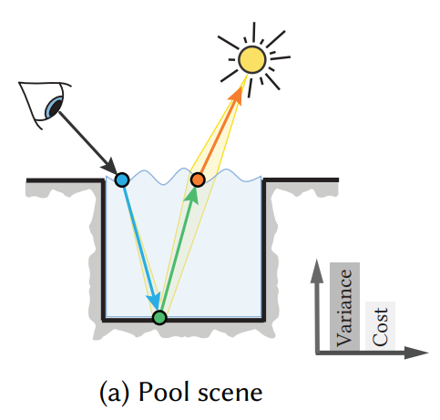

## 简介

本篇文章主要介绍了一种在离线渲染中优化 Path Tracing 中 Russian Roulette 和 Splitting 的方法。

首先，Splitting 即在 Path Tracing 的过程中，到某个 bounce 后，分叉出多条光线进行 trace，最后计算该点光照贡献时按权重进行平均的一种技术。

作为例子，考虑如下的场景（图源论文）：

该场景中，池底的表面为漫反射材质，但是路径中其它的部分的 BSDF / BRDF 都比较趋向于 Delta 分布。这时，如果可以在绿色点进行 Splitting，对不需要 Splitting 的路径实现复用，就可以帮助以更小的开销实现较低方差的渲染。

在每次 bounce 时，PathTracer 都需要进行一个决策：
- (Russian Roulette) 是否需要截止这条光线？以多少概率截止？
- (Splitting) 是否需要将这条光线分裂成多份？如果需要的话，分裂成多少份？

这些因子显然是和场景相关的，而选择好这些因子可以加速 Path Tracing 的收敛过程。

## Formulation

TODO