## 简介

本篇文章介绍了 NeRF 硬件加速的实现。

## NeRF 回顾

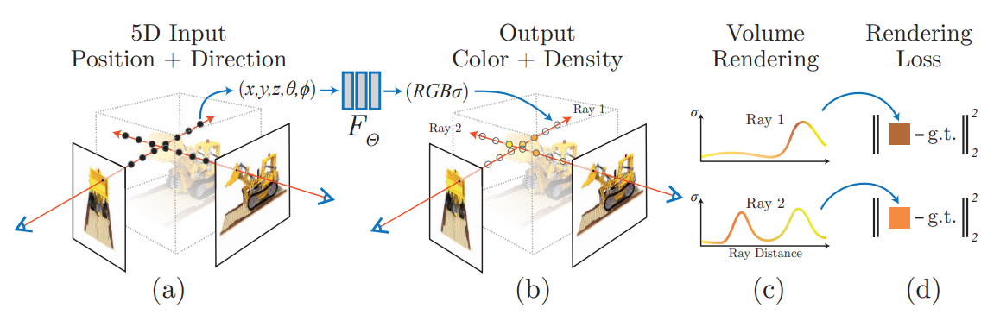

Neural Radiance Field，简称 NeRF，最开始在 ECCV 2020 上[被提出](https://www.matthewtancik.com/nerf)，提出了以神经网络编码辐射场的一种技术，并且将其运用到了基于图片的场景重建等多个领域中，是近年来受关注度相当高的一篇工作。

NeRF 的网络部分输入为 5D: 位置 $ (x,y,z) $ 和朝向 $ (\theta, \phi) $，输出为该位置的 RGB 颜色和密度。

NeRF 在给定相机位置下最终渲染的输出用类似体渲染 (Volumetric Rendering) 的办法来实现。

### NeRF 体渲染

对给定的相机光线 $ {\bf r}(t) = {\bf o} + t{\bf d} $ 来说，最终输出的颜色 $ {\bf C}(r) $ 以下式表示：

$$
C({\bf r}) = \int_{t_n}^{t_f} T(t) \sigma({\bf r}(t)) {\bf c}({\bf r}(t), {\bf d}) dt 
$$

其中：
- $ T(t) = \exp (-\int_{t_n}^{t} \sigma({\bf r}(s)) ds ) $ 为光线从 $ t_n $ 能打到 $ t $ 的概率
  - 比如说，如果射线穿过的部分密度都比较大，那 $ T(t) $ 就会比较小
- $ \sigma({\bf r}(t)) $ 是该 $ t $ 对应的点 $ {\bf r}(t) $ 的密度
- $ {\bf c}({\bf r}(t), {\bf d}) $ 是网络给定方向和位置后输出的 RGB 颜色值
- $ t_n $ 和 $ t_f $ 分别为射线进入和射出 NeRF 有效区域的包围盒时所对应的最近和最远参数值

不过这个积分显然不能很容易的解析求解，NeRF 的做法是采用数值积分的那一套。

首先，利用分层抽样 (stratified sampling) 的技术，将 $ [t_n, t_f] $ 分成 $ N $ 个均匀的小区间，然后在每个小区间均匀采样出一个 $ t_i $ 出来。

然后，用下面的量 $ \hat C({\bf r}) $ 来估计上面的 $ C({\bf r}) $：

$$
\hat C({\bf r}) = \sum_{i=1}^{N} T_i (1-\exp(-\sigma_i \delta_i)) {\bf c}_i
$$

其中：
- $ T_i = \exp(- \sum_{j=1}^{i-1} \sigma_j \delta_j) $
- $ \delta_i = t_{i+1} - t_i $ 为两临近采样点的距离

> 为什么会变成这个形式？可以参考 arXiv 上的 [Volume Rendering Digest (for NeRF)](https://arxiv.org/pdf/2209.02417.pdf)

<!-- 没看，TODO: 研究一下 -->

原文中提到，从所有的 $ ({\bf c}_i, \delta_i) $ 对考虑的话，$ \hat C(r) $ 的计算显然是可微的，并且可以看成从最开始一直用 $ \alpha_i = 1 - \exp(\sigma_i \delta_i) $ 的透明度往上面做 alpha blending。

<!-- TODO: why alpha value like that -->

### NeRF 网络

网络部分用位置编码 (Positional Encoding) + Coarse MLP + Fine MLP。

#### 位置编码 

位置编码用来改善网络对高频细节的学习效果。

位置编码层可以如下描述：

$$
\gamma(p) = (\sin(2^0 \pi p), \cos(2^0 \pi p), ..., \sin(2^{L-1} \pi p), \cos(2^{L-1} \pi p))
$$

#### Coarse & Fine MLP

NeRF 同时使用两个 MLP 来表示场景，一个粗粒度 MLP 和一个细粒度 MLP。

渲染的时候，首先用分层抽样的办法，在粗粒度网络中用前面提到的体渲染方法进行渲染，并且得到输出 $ \hat C_c(r) $：

$$
\hat C_c(r) = \sum_{i=1}^{N_c} w_i c_i, \quad w_i = T_i (1-\exp(\sigma_i \delta_i))
$$

然后，计算归一化权重 $ \hat w_i = w_i / \sum_{i=1}^{N_c} w_i $，并且用计算好的归一化权重作为概率分布函数 (cumulative distribution function)，再在这条直线上采样 $ N_f $ 个位置，将这 $ N_c + N_f $ 个位置送入细粒度 MLP 进行推理，再用前面的办法渲染得到最终的颜色值。

#### 损失函数

采用简单的把 Coarse MLP 和 Fine MLP 与真实值之间的 $ L^2 $ 损失直接加起来的办法。

## ICARUS

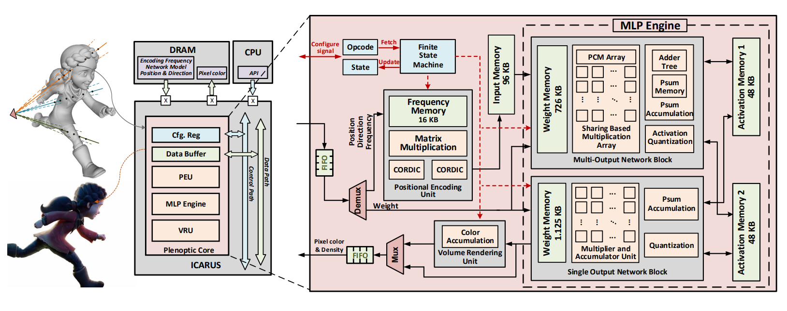

### NeRF 计算过程回顾

1. 对像素所发出射线上的采样，得到点 $ ({\bf p}_1, ..., {\bf p}_N) $
2. 查询 MLP 网络：$ ({\bf p}_i, {\bf d}_i) \to ({\bf c_i}, \sigma_i) $
3. 进行多次 alpha-blending

### 架构设计

架构设计时主要有以下目标：
1. "端到端" - 芯片输入位置和方向，输出像素颜色，减少片上片外数据交换的额外开销（计算时间、功耗）
2. 使用定点数 - 有效降低浮点数运算开销
3. 架构设计要一定灵活性，尽量兼容比较多的 NeRF 衍生网络

#### 如何使用定点数？

目前的实现是将在 GPU 上训练好的 NeRF 的权重进行量化 (quantization)，再导出。不过，目前也有一些工作在 quantization-aware training 方面，可能对这个网络的训练过程有所帮助。

### 位置编码单元 (PEU)

设计位置编码单元 (Positional Encoding Unit, PEU) 的目的是在 PEU 前和 PEU 后的向量维数增加了很多倍（对原 NeRF 来说位置是 20 倍，方向是 8 倍），如果在 ICARUS 内部进行计算的话，可以减少很大一部分外部存储传输，降低传输总用时。

PEU 部件主要在做这件事：

$$
\phi(x; A) = [\cos A^T x, \sin A^T x]
$$

其中 $ A $ 一般为一个行数比列数多的矩阵，用来升维。

PEU 单元对应的设计如下 (Fig. 4(b))：

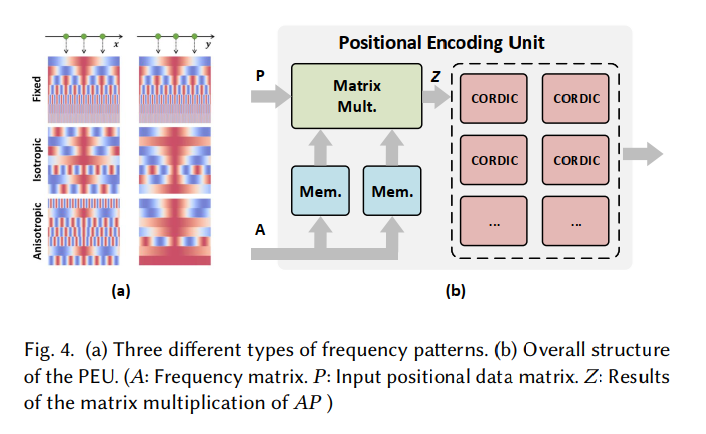

可以看到，就是矩阵乘法单元和 CORDIC 单元的组合。

> 一些关于矩阵乘和 CORDIC 单元的大概印象：
> 矩阵乘：有很多工作，比如搜索 Systolic array 等等
> - 不过我不清楚 SOTA 情况
> CORDIC: https://zipcpu.com/dsp/2017/08/30/cordic.html
> - 不过我也不清楚 SOTA 情况

具体设计上来说，ICARUS 支持对 dim=3 和 dim=6 的两种输入进行位置编码，并且扩展到 dim=128。PEU 内部设计有两个 3x128 的内存块和 6 组 MAC (Multiply-ACcumulate) 单元，当计算 dim=6 的输入时会全部启用，当计算 dim=3 的输入时只启用一半。

### MLP Engine

MLP 引擎主要进行 $ f(Wx+b) $ 类型的计算。

MLP 引擎包含有：
- 一个 Multi-output Network block (MONB)，负责计算中间的隐藏层
- 一个 Single-output network block (SONB)，负责计算最后的输出层
  - 不继续用 MONB 的原因是，全连接的 MONB 比只输出一个数字的 SONB 面积要大得多
- 两个 activation memory block

对于 MLP 计算来说，实现是这样的：

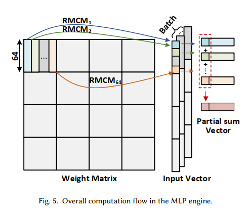

首先，将 MLP 的权重拆成 64 x 64 的小块，方便硬件上的复用，并且同样的权重可以被多组输入向量复用，从而降低内存带宽开销，代价方面只需要暂存该 batch 内的中间结果就可以（这里选择 `batch_size=128`）。

每个 64 x 64 的矩阵-向量乘法再进行分片，变成按矩阵列分割的 64 个列向量 - 向量的内积乘法（即 $ [\alpha_1 ... \alpha_{64}] [x_1 ... x_{64}]^T $，每个 $ \alpha_i x_i $ 的部分和用一个 RMCM 模块实现：

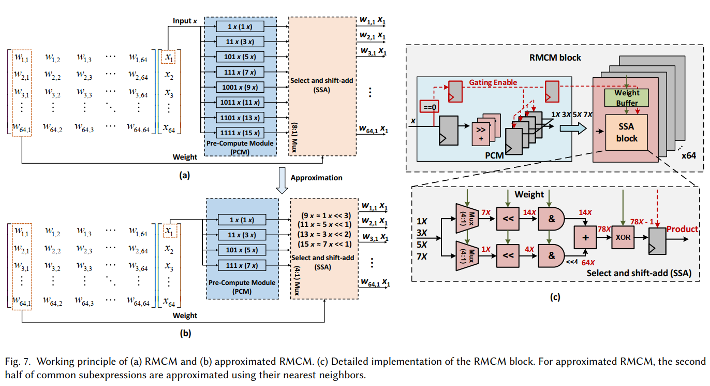

大概来说，是因为乘法可以变成移位加法：

$$
3x = 1x << 1 + 1x
$$

所以权重 load 进来的作用就是预先选择好路径上的移位和加法器，然后数据从这些器件中流过去就行。

另一个优化是高一半的移位和加法路径直接用上一次的值来替换，然后网络训练的时候也作此改动。这样可以节省 1/3 的面积，同时输出基本没有视觉质量损失。

SONB 的架构基本上和 MONB 差不多，只是 RMCM 块用不到了，用普通的向量乘法块就可以了。

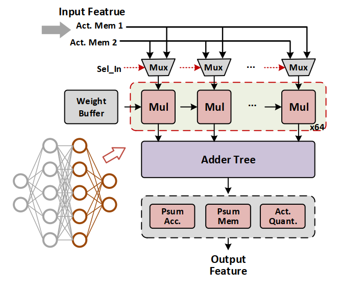

### Volume Rendering Unit

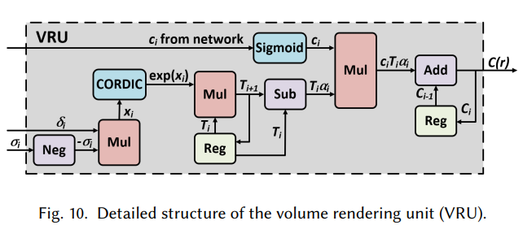

VRU 模块主要要负责下面的计算：

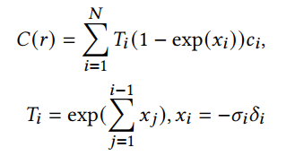

这里，他处理成下面的形式：

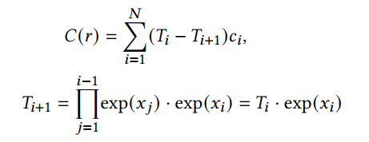

然后用上面的网络计算。

### 原型验证

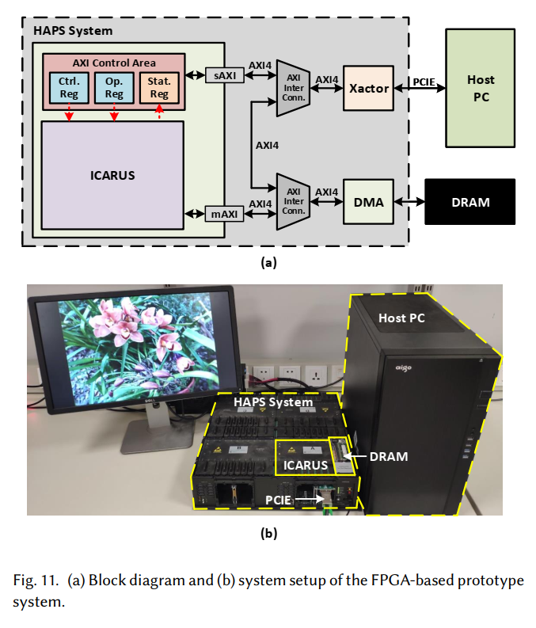

验证平台使用的是 Synopsys HAPS-80 S104，验证时使用的工艺是 40nm CMOS 工艺。

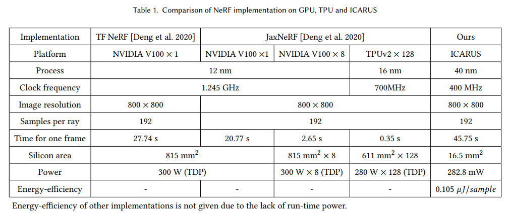

<!-- 
#### 调整到 Surface Light Field 任务

> TODO

-->