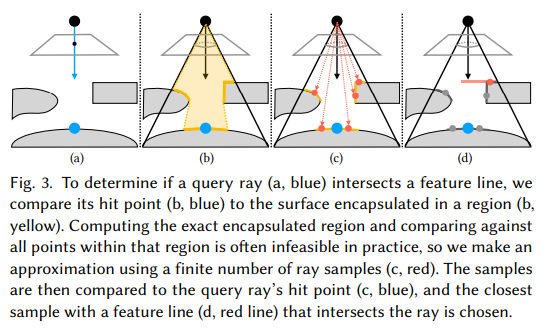
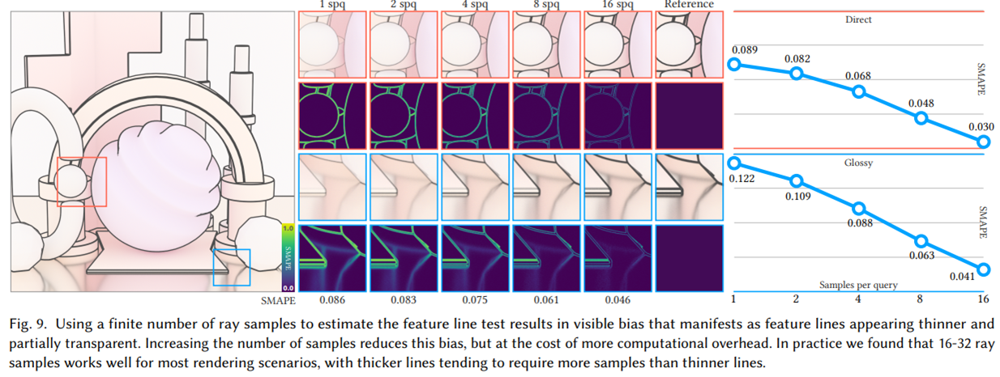
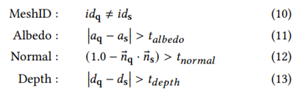
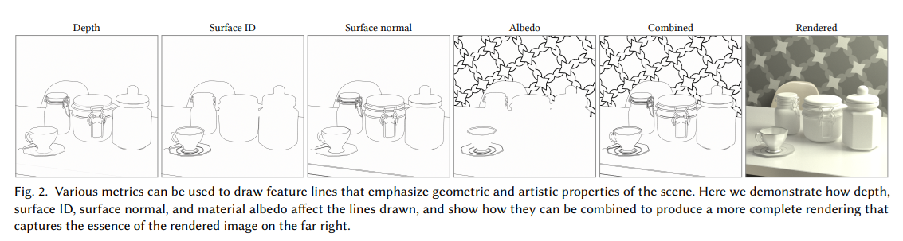
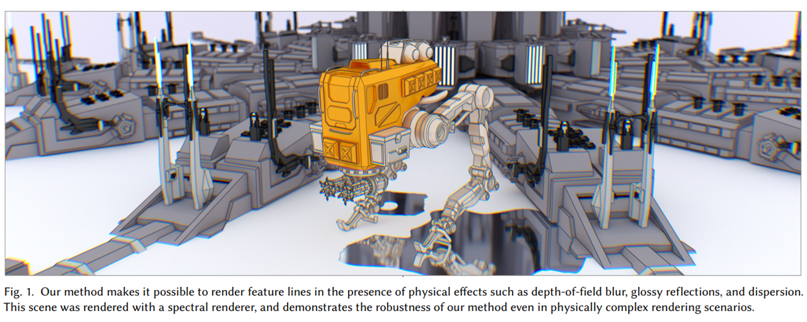

## 简介

本篇文章介绍了基于物理的特征线渲染方法。

特征线渲染是一种非真实感渲染技术，常常被用在剪影、产品效果图等一些需要特殊的艺术效果的场合。

本篇文章提出的，基于路径方法的特征线渲染方法，是基于如下的两方面观察：
1. 从路径的角度出发，现有的特征线渲染方法将特征线处理成了光源
2. 特征线相交测试可以对任意的边开展，而不仅仅是在屏幕空间中

基于上面的观察，本文提出的方法
1. 对一整个路径中每条路径段分别进行和特征线的相交测试
2. 将交到的特征线视为吸收所有入射光，然后辐射用户自定义颜色的光源

> TL;DR: 用 Path Tracing 做描边，把要描的边处理成光源，让描边也有景深、色散和反射等效果。

## 算法描述

算法的基本架构很简单。

从传统的 Path Tracer 出发：
1. 对每个 path segment 依次进行和特征线的相交判断，并且
2. 如果相交，则将特征线视为理想光源，并不再追下面的光源

### 相交判断

从该 path segment 出发，以固定扩张率和当前路径总长度做一锥体，寻找锥体中的特征线。

实现上，本文采用从锥体较窄的一端发射查询射线，并且判断交点是否为特征线上的点的方法来进行判断，可能和 cone tracing 比较相似。

### 采样权重修改

前面提到，“如果相交，则将特征线视为理想光源，并不再追下面的光源”。本文中会将这种情况整条采样路径每个点的 pdf 值处理成和打到刚好有光源位于这里的情况完全一致。

不过，这样会让整个估计变成有偏估计，因为还存在有特征线（i.e. 有光源）但是没有采样到的情况，这种情况使用正常 pdf 会让最后相机处接收的 Irradiance 期望偏小，也就是特征线会比无偏的情况更不明显。

比较幸运的是，通过加密相交判断中发射的查询射线的数量，可以渐进的趋于无偏的情况。

### 特征线判据

特征线的判断通过锥体中采样到的点和本 path segment 的起点和终点联合进行判断，主要有 MeshID, Albedo, Normal 和 Depth 四个方面的判据。

> 其中 $ t_{\text{depth}} $ 文中提到有一个较为启发的设置方法。

各项的效果如图所示：

## 效果

可以参考本文 Teaser：

可以看到，本文渲染的特征线有色散、景深模糊、反射等基于物理的效果。

## 未来的工作

文章最后主要提及了如下的 Future Work：

- 其它路径采样方法 (i.e. BDPT)
- 特征线锥形区域估计改进
- 特征线区域缓存
- 特征线模型改进
  - 反射 / 半透特征线模型等
- 将 lens blur 和色散效果集成到 [Stylized Focus](https://pixl.cs.princeton.edu/pubs/Cole_2006_DGI/index.php)
  - Stylized Focus 主要通过多个光栅化 pass 的叠加来实现风格化的景深和聚焦效果
