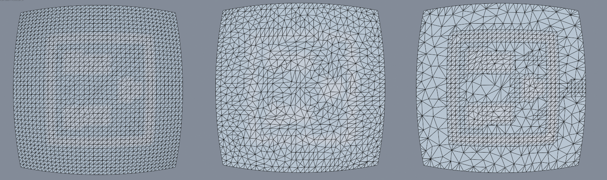

> 注：请根据上下文猜测哪些是矢量，哪些是标量，因为作者懒得打了。

## 简介

QEM 算法（[Garland and Heckbert [1998]](http://dl.acm.org/citation.cfm?id=288280)）是网格简化领域的经典算法。

### 相关实现

[GitHub - byreave/MeshSimplification-QEM: A C++implementation of QEM algorithm.](https://github.com/byreave/MeshSimplification-QEM)

[GitHub - WZFish/QEM-MeshSimplification](https://github.com/WZFish/QEM-MeshSimplification)

[GitHub - songrun/SeamAwareDecimater: Mesh simplification with UV's boundary preserved](https://github.com/songrun/SeamAwareDecimater)

[GitHub - MeshFrame/MeshFrame: A light-weighted, efficient and header-only mesh processing frame work](https://github.com/MeshFrame/MeshFrame/blob/master/Examples/MeshSimplifyQEM/mesh.cpp)

## QEM Original

> 出现于文章 [Surface Simplification Using Quadric Error Metrics](https://www.cs.cmu.edu/~./garland/Papers/quadrics.pdf) 中

### Formulation

设现在有网格 $ M = (V, F) $，规定**可收缩顶点对**为

1. 原网格中的边
2. $ \| v_1 - v_2\| < \epsilon $ 的顶点对 $ (v_1, v_2) $

对每个三角形 $ F_i $，设构成该三角形的三个顶点为 $ v_0, v_1, v_2 $，则 $ F_i $ 上的点 $ v_f $ 满足方程
$$
(\vec v_f- \vec v_0) \cdot \vec n = 0 \Rightarrow \vec v_f \cdot \vec n - \vec {v_0} \cdot \vec n = 0
$$

其中面法线 $ \vec n $ 满足
$$
\vec {n} =  \frac{(\vec v_1 -\vec  v_0) \times (\vec v_2 - \vec v_0)}{\| (\vec v_1 -\vec  v_0) \times (\vec v_2 - \vec v_0) \|}
$$

空间中任意一点 $ v $ 到平面 $ F_i $ 的距离的平方为
$$
\begin{aligned}
d^2(v, F_i) &= \| (\vec v-\vec v_0) \cdot \vec n \|^2 \\
&= (n^\mathbf{T} v - n^\mathbf{T} v_0 )^2 \\
&= v^\mathbf{T} (nn^\mathbf{T}) v - 2 n^\mathbf{T} v_0 n^\mathbf{T}v + (n^\mathbf{T} v_0)^2
\end{aligned}
$$
定义
$$
\begin{aligned}
{\bf A}_{3\times 3} &= n n^\mathbf{T}\\ 
d &= -n^\mathbf{T} v_0 \\
\vec b_{3 \times 1} &= d n \\
c &= d^2
\end{aligned}
$$
则
$$
d^2(v, F_i) = v^\mathbf{T} {\bf A} v + 2b^\mathbf{T} v + c
$$
这个距离平方也可以写成齐次形式
$$
d^2(v, F_i) = h^\mathbf{T} {\bf Q} h \\
\text{where} \ {\bf Q}_{4\times4} = \begin{pmatrix} {\bf A}_{3 \times 3} & b_{3 \times 1} \\ b^\mathbf{T} _{1 \times 3}& c_{1 \times 1} \end{pmatrix} \ \text{and} \ h= \begin{pmatrix} \vec v \\ 1 \end{pmatrix}
$$
所以，对于每一个平面 $ F_i $，都可以定义一个二次型 $ Q_{F_i}(v) = h^\mathbf{T} \mathbf{Q} h $，其为任意一点 $ v$ 到该平面距离的平方。

对于顶点 $ v $，该顶点到相邻的所有表面的距离平方和可以表示为 $ \sum_{i \in \operatorname{neigh}(v_i)} Q_{F_i}(v) = (\sum_{i \in \operatorname{neigh}(v_i)} Q_{F_i})(v) $ 。

### Framework

QEM 算法的框架如下：

- 每个顶点 $ v_i $ 按上面的方法赋予一个 Q 矩阵，$ Q_{v_i} = \sum_{i \in \operatorname{neigh}(v_i)} Q_{F_i} $

- 收缩 $(v_i, v_j)$ 边到 $ v' $ 时，定义这次收缩的代价为 $ Q(v') = (Q_{v_i} + Q_{v_j})(v')$；每次全局的选择最小代价的边进行收缩

  - 如何选择 $ v' $？有 Optimal Placement 和 Subset Placement 两种形式：
    1. (**Optimal Placement**) $ {\bf A} $ 可逆时
    
       令 $ \frac{\partial}{\partial v}(v^\mathbf{T} {\bf A} v + 2b^\mathbf{T} v + c) = 0 $，解得 $ v_\text{optimal} = -{\bf A}^{-1} b $ 
    
    2. (**Subset Placement**) $ {\bf A} $ 不可逆时，选择两个端点或中点；看哪个 edge loss 小

- 收缩后的顶点 $ v' $ 更新

  > 这里对算法有两种理解，第一种是按初始计算的方法重新按邻面赋予 Q 矩阵（这样就是一个完全 local 的方法），第二种理解是合并两个顶点，则将对应的 Q 矩阵也进行合并。
  >
  > 文章中的做法是**第二种理解**，从文章提到 implicit track sets of planes 可以知道。不过在 Discussion 处也讨论了这种做法的问题：
>
  > *Second, the information accumulated in the quadrics is essentially implicit, which can at times be problematic. Suppose we join together two cubes and would like to remove the planes associated with the now defunct interior faces. Not only is it, in general, difficult to determine what faces are defunct, there is no clear way to reliably remove the appropriate planes from the quadrics. As a result, our algorithm does not do as good a job at simplification with aggregation as we would like.*

  -  $ Q_{v'} = Q_{v_1} + Q_{v_2} $

值得注意的是， $ Q(v') = (Q_{v_i} + Q_{v_j})(v')$ 会导致一些 double counting 的现象发生，即有些公共面构造的 Q 分量被重复求和了。但作者提到，这样的重复对效果的影响有限。

> 这里引用了 Donald E. Knuth. The Art of Computer Programming, volume 1. Addison Wesley, Reading, MA, Third edition, 1997.
>
> 不是很懂高德纳老爷子和 inclusion-exclusion rule 对效果的改善的关系...

### Preserving Boundaries

对于不希望边界移动的情况，可以首先标记将边标记为**正常边**和**边界边**两种（这个边界边不一定需要是真的网格边界，只是比较不希望移动的边）。

对于标记为**边界边**的边 $(v_1, v_2)$，令和其相邻的所有面的 Q 矩阵中增加一项反映到垂直于该平面、且过该**边界边**的一个平面的距离平方的项。

设边界边 $(v_1, v_2)$，不妨设某个相邻的三角形 $ F_i $ 的三个顶点为 $v_1, v_2, v_3$，则与之相对的边界平面 $ F_{B_i} $ 可以计算如下
$$
n_{F_i} = \operatorname{normalize}{ \left((v_2 - v_1) \times (v_3 - v_1) \right)} \\
n_{F_{B_i}} = \operatorname{normalize}{\left( n_{F_i} \times (v_2 - v_1) \right)} \\
\forall v \in F_{B_i},\ \vec {n_{F_{B_i}}} \cdot (\vec v - \vec {v_1}) = 0 \Rightarrow \vec {n_{F_{B_i}}} \cdot \vec v +(- \vec {n_{F_{B_i}}} \cdot \vec {v_1}) = 0
$$
则到边界平面 $ F_{B_i} $ 的距离平方计算如下：
$$
d^2(v, F_{B_i}) = h^\mathbf{T} \mathbf{Q} h \\
\text{where} \ {\bf Q}_{4\times4} = 
\begin{pmatrix}
{\bf A}_{3 \times 3} & b_{3 \times 1} \\
b^\mathbf{T} _{1 \times 3}& c_{1 \times 1}
\end{pmatrix} = 
\begin{pmatrix}
n_{F_{B_i}}n_{F_{B_i}}^{\bf T} & (- n_{F_{B_i}} \cdot {v_1}) {n_{F_{B_i}}} \\
(- n_{F_{B_i}} \cdot {v_1}) n_{F_{B_i}}^{\bf T} & (- n_{F_{B_i}} \cdot {v_1}) ^2
\end{pmatrix}
\ \text{and} \ h= \begin{pmatrix} \vec v \\ 1 \end{pmatrix}
$$
把他加入到相邻面的 Q 矩阵中，最后就会进入各个边的 Q 矩阵。

## Appearance Preserving QEM

> 出现于文章 [Simplifying Surfaces with Color and Texture using Quadric Error Metrics](https://www.cs.cmu.edu/~garland/Papers/quadric2.pdf) 中

对于**连续**的顶点属性来说，可以通过把他们加入向量中一起优化的方法来解决。这种方法本质上是原来 QEM 的推广，将原来的到平面的距离推广为了到平面上三点的位置和其它顶点属性共同确定的**超平面**的距离。

同时，本文中调整了**可收缩顶点对**的定义，将其限制在了原三角网格中的边的范围内，因为可靠性不够好。

> Our experience has shown that, while greedy edge contraction produces consistently good results on many kinds of models, greedy contraction of arbitrary pairs is not as robust and does not perform as consistently.

### Formulation

将上面的三角形 $ F_i $ 的各个顶点 $ v_i $ 从 $ \mathbb{R}^3 $ 推广到 $ \mathbb{R}^n $，我们知道 3 个 $ \mathbb{R}^n $ 中的点（非线性相关）仍然确定一个 $ \mathbb{R}^2 $ 平面，这个平面的两个**标准正交**基向量 $ e_1 $，$ e_2 $ 可以用 Schmidt 正交化的办法得到：
$$
\begin{aligned}
e_1 &= \operatorname{normalize}{(v_2-v_1)} \\
e_2 &= \operatorname{normalize}{((v_3 - v_1) - (e_1 \cdot (v_3 - v_1)) e_1)}
\end{aligned}
$$
这样，对于 $ v \in \mathbb{R}^n $，有
$$
\begin{aligned}
d^2(v, F_i) &= \| v - v_1 \|^2 - ((v-v_1)\cdot e_1)^2 - ((v-v_1)\cdot e_2)^2 \\
&= (v-v_1)^{\bf T}(v-v_1) - ((v-v_1)^{\bf T}e_1)(e_1^{\bf T}(v-v_1)) - ((v-v_1)^{\bf T}e_2)(e_2^{\bf T}(v-v_1)) \\
&= (v^{\bf T} v - v_1^{\bf T}v-v^{\bf T} v_1 + v^{\bf T}_1 v_1) - \\
& \ \quad (v^{\bf T}e_1 e_1^{\bf T}v -v^{\bf T}_1 e_1 e_1^{\bf T}v - v^{\bf T}e_1 e_1^{\bf T} v_1 + v_1^{\bf T} e_1 e_1^{\bf T} v_1) - \\
& \ \quad (v^{\bf T}e_2 e_2^{\bf T}v -v^{\bf T}_1 e_2 e_2^{\bf T}v - v^{\bf T}e_2 e_2^{\bf T} v_1 + v_1^{\bf T} e_2 e_2^{\bf T} v_1) \\
&= (v^{\bf T} v - 2v_1^{\bf T}v + v^{\bf T}_1 v_1) - \\
& \ \quad (v^{\bf T}e_1 e_1^{\bf T}v -v^{\bf T}_1 e_1 e_1^{\bf T}v - (v_1^{\bf T} e_1 e_1^{\bf T} v)^{\bf T} + v_1^{\bf T} e_1 e_1^{\bf T} v_1) - \\
& \ \quad (v^{\bf T}e_2 e_2^{\bf T}v -v^{\bf T}_1 e_2 e_2^{\bf T}v - (v_1^{\bf T} e_2 e_2^{\bf T} v)^{\bf T}  + v_1^{\bf T} e_2 e_2^{\bf T} v_1) \\
&= (v^{\bf T} v - 2v_1^{\bf T}v + v^{\bf T}_1 v_1) - \\
& \ \quad (v^{\bf T}e_1 e_1^{\bf T}v -v^{\bf T}_1 e_1 e_1^{\bf T}v - (v_1^{\bf T} e_1 e_1^{\bf T} v) + v_1^{\bf T} e_1 e_1^{\bf T} v_1) - \\
& \ \quad (v^{\bf T}e_2 e_2^{\bf T}v -v^{\bf T}_1 e_2 e_2^{\bf T}v - (v_1^{\bf T} e_2 e_2^{\bf T} v)  + v_1^{\bf T} e_2 e_2^{\bf T} v_1) \\
&= v^{\bf T} ({\bf I} - e_1 e_1^{\bf T} - e_2 e_2^{\bf T}) v + 2(v^{\bf T}_1 e_1 e_1^{\bf T} + v^{\bf T}_1 e_2 e_2^{\bf T}-v_1^{\bf T}) v + (v^{\bf T}_1 v_1 -v_1^{\bf T} e_1 e_1^{\bf T} v_1 - v_1^{\bf T} e_2 e_2^{\bf T} v_1) \\
&= v^{\bf T} ({\bf I} - e_1 e_1^{\bf T} - e_2 e_2^{\bf T}) v + 2(e_1 e_1^{\bf T}v_1 +e_2 e_2^{\bf T} v_1 - v_1)^{\bf T} v + (v^{\bf T}_1 v_1 -v_1^{\bf T} e_1 e_1^{\bf T} v_1 - v_1^{\bf T} e_2 e_2^{\bf T} v_1) \\
&= v^{\bf T} ({\bf I} - e_1 e_1^{\bf T} - e_2 e_2^{\bf T}) v + 2((e_1 \cdot v_1)e_1  +(e_2 \cdot v_1)e_2 - v_1)^{\bf T} v + (v_1 \cdot v_1 - (v_1\cdot e_1)^2 - (v_1 \cdot e_2)^2)

\end{aligned}
$$
仿照前面，整理成 Q 矩阵的形式
$$
d^2(v, F_i) = v^\mathbf{T} {\bf A} v + 2b^\mathbf{T} v + c \\
\text{where}\ \left\{
\begin{aligned}
{\bf A}_{n\times n} &= {\bf I} - e_1 e_1^{\bf T} - e_2 e_2^{\bf T} \\
{\bf b}_{n\times 1} &= (e_1 \cdot v_1)e_1  +(e_2 \cdot v_1)e_2 - v_1 \\
c_{1\times 1} &= v_1 \cdot v_1 - (v_1\cdot e_1)^2 - (v_1 \cdot e_2)^2
\end{aligned}
\right.
$$

### Preserving Boundaries

将原始的 QEM 边界处理方法直接搬到 $ \mathbb{R}^n $ 会比较困难，因为 $ \mathbb{R}^n $ 下过两个 $ \mathbb{R}^n $ 的点并且垂直于一个平面的平面有很多个。

> 平面在 $ \mathbb{R}^n $ 中即为一个 $ \mathbb{R}^2 $ 子空间，垂直于该平面的向量现在构成一个“法空间”（其为 $ \mathbb{R} ^n / \mathbb{R} ^2 $ 的商空间），其维数为 $ n - 2 $，那 $ \mathbb{R}^n $ 下过两个 $ \mathbb{R}^n $ 的点并且垂直于一个平面的平面 $ \iff $  $ \mathbb{R}^n $ 下过两个 $ \mathbb{R}^n $ 的点和一个法空间中的点  $ \Rightarrow $ 这样的平面至少有 $ n - 2 $ 个

所以，这里考虑直接锁边界。

## 效果展示

0.5 ratio